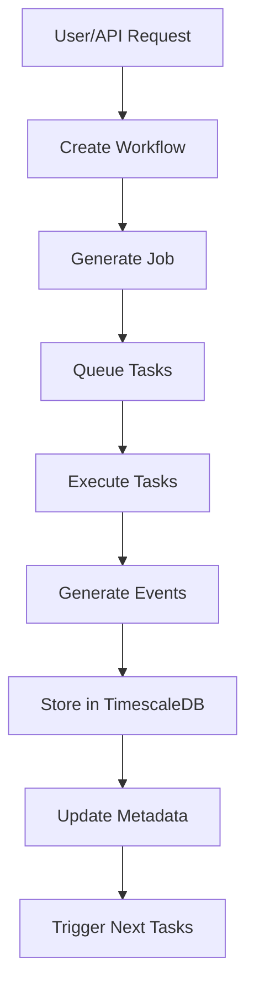

# Galactus UI/UX Design

## Overview

Galactus provides both a user-friendly web interface for human operators and a comprehensive REST API for automated systems (LLMs, scripts, etc.). This dual approach enables both interactive lab management and fully automated operations.

## User Interface Architecture

### 🎯 **Target Users**

1. **Lab Scientists**: Need intuitive interface for experiment design
2. **Lab Technicians**: Require workflow monitoring and control
3. **System Administrators**: Need device and template management
4. **Automated Systems**: Use REST API for programmatic control

### 🖥️ **UI Components Overview**

```
galactus_ui/
├── public/                 # Static assets
├── src/
│   ├── components/         # Reusable UI components
│   │   ├── forms/          # Task/Workflow creation forms
│   │   ├── dashboard/      # Monitoring dashboards
│   │   ├── device/         # Device management
│   │   └── common/         # Shared components
│   ├── pages/             # Main application pages
│   │   ├── home/          # Landing/dashboard
│   │   ├── templates/     # Task template management
│   │   ├── workflows/     # Workflow design
│   │   ├── devices/       # Device management
│   │   └── jobs/          # Job monitoring
│   ├── hooks/             # React hooks
│   ├── utils/             # Utility functions
│   └── api/               # API client
└── package.json           # Dependencies
```

## Key UI Capabilities

### ✅ **Task Template Creation**

#### **Visual Template Builder**
- **Drag & Drop Interface**: Users can drag device types and create task flows
- **Schema Editor**: Visual form builder for input/output schemas
- **Validation Preview**: Real-time validation of task parameters
- **Template Gallery**: Pre-built templates for common operations

#### **Template Creation Workflow**
1. **Select Device Types**: Choose compatible devices from registry
2. **Define Input Schema**: Specify required and optional parameters
3. **Configure Output Schema**: Define expected results and file outputs
4. **Set Execution Rules**: Configure retry logic, timeouts, dependencies
5. **Preview & Test**: Validate template with sample data

#### **Advanced Features**
- **Conditional Logic**: Branching based on input parameters
- **Parameter Templates**: Reusable parameter configurations
- **Version Control**: Track template changes over time
- **Collaboration**: Share templates across team members

### ✅ **Workflow Generation & Management**

#### **Workflow Designer**
- **Visual DAG Editor**: Drag-and-drop task arrangement
- **Sample Matrix**: Define sample variations (composition, properties)
- **Dependency Mapping**: Visual representation of task dependencies
- **Resource Planning**: Preview resource allocation and scheduling

#### **Sample Management**
- **Batch Operations**: Create multiple samples with variations
- **Composition Builder**: Visual chemical composition editor
- **Property Templates**: Standard property sets for sample types
- **Import/Export**: CSV/Excel integration for bulk operations

#### **Workflow Templates**
- **Template Library**: Pre-configured workflow patterns
- **Parameter Sweeps**: Automated variation generation
- **Optimization Targets**: Define objectives for autonomous optimization
- **Validation Engine**: Ensure workflow feasibility before submission

### ✅ **Job Submission & Monitoring**

#### **Job Dashboard**
- **Queue Status**: Real-time view of job progress
- **Resource Monitor**: Device utilization and availability
- **Performance Metrics**: Task completion rates and bottlenecks
- **Alert Management**: System notifications and error handling

#### **Real-time Monitoring**
- **Live Updates**: WebSocket connections for real-time status
- **Interactive Charts**: Time-series data visualization
- **Log Streaming**: Live log output from running tasks
- **Remote Control**: Pause, resume, cancel operations

## API-First Design

### 🤖 **REST API for Automation**

#### **Task Template API**
```python
# Create task template programmatically
template = await api_client.create_task_template({
    "name": "xrd_analysis",
    "input_schema": {
        "sample_id": {"type": "string", "required": True},
        "scan_range": {"type": "object", "required": True,
                      "properties": {"min": 10, "max": 80}}
    },
    "output_schema": {
        "pattern_file": {"type": "file", "required": True,
                        "file_config": {"bucket": "analysis-data"}},
        "analysis_results": {"type": "object", "required": True}
    },
    "required_device_types": ["xrd_diffractometer"]
})
```

#### **Workflow Generation API**
```python
# Generate workflow programmatically
workflow = await api_client.create_workflow({
    "name": "material_characterization_study",
    "task_graph": {
        "tasks": {
            "xrd_001": {
                "type": "xrd_analysis",
                "parameters": {"scan_range": {"min": 20, "max": 60}},
                "samples": ["sample_1", "sample_2", "sample_3"]
            },
            "sem_001": {
                "type": "sem_imaging",
                "parameters": {"magnification": 1000},
                "samples": ["sample_1", "sample_2", "sample_3"]
            }
        },
        "dependencies": {
            "xrd_001": [],
            "sem_001": ["xrd_001"]  # SEM after XRD
        }
    },
    "samples": [
        {"name": "sample_1", "composition": {"Cu": 0.5, "Zn": 0.5}},
        {"name": "sample_2", "composition": {"Cu": 0.7, "Zn": 0.3}},
        {"name": "sample_3", "composition": {"Cu": 0.3, "Zn": 0.7}}
    ]
})
```

#### **LLM Integration**
```python
# Example LLM prompt response
llm_response = {
    "experiment_goal": "Find optimal Cu-Zn ratio for catalyst",
    "suggested_tasks": [
        {
            "type": "synthesis",
            "parameters": {"temperature": 300, "duration": 60},
            "samples": [{"Cu_ratio": 0.5}, {"Cu_ratio": 0.7}, {"Cu_ratio": 0.3}]
        },
        {
            "type": "characterization",
            "parameters": {"techniques": ["XRD", "SEM", "XPS"]},
            "depends_on": ["synthesis"]
        }
    ]
}

# Convert to Galactus workflow
workflow = await api_client.create_from_llm_response(llm_response)
```

## Data Architecture & Relationships

### 🗄️ **Relational Data Model**

#### **Core Entities**
- **Task Templates** → Define reusable task patterns
- **Workflows** → Combine tasks into executable sequences
- **Samples** → Physical or virtual samples with properties
- **Jobs** → Executable instances of workflows
- **Devices** → Physical lab equipment

#### **Event-Driven Data Flow**


#### **Metadata Relationships**
- **Events** reference Tasks, Workflows, Jobs, and Samples
- **Task Results** include file uploads with S3 references
- **Sample Properties** linked to analysis results
- **Device Logs** correlated with task execution
- **Workflow Progress** tracked through event streams

## File Upload Integration

### 📁 **S3 File Management**

#### **Output Schema File Support**
```json
{
  "task_template": {
    "output_schema": {
      "analysis_report": {
        "type": "file",
        "required": true,
        "file_config": {
          "bucket": "analysis-results",
          "max_size": "100MB",
          "allowed_types": ["pdf", "csv", "json", "png"]
        }
      },
      "raw_data": {
        "type": "file",
        "required": false,
        "file_config": {
          "bucket": "raw-data",
          "retention_days": 30
        }
      }
    }
  }
}
```

#### **File Upload Process**
1. **Task Execution**: Task generates file output
2. **S3 Upload**: Automatic upload to configured bucket
3. **Metadata Storage**: File URL and metadata stored in database
4. **Event Generation**: File creation event triggers downstream processes
5. **Access Control**: Configurable permissions and lifecycle policies

## User Experience Flows

### 🔬 **Scientist Workflow**

#### **1. Experiment Design**
1. **Browse Templates**: Search existing task templates
2. **Customize Parameters**: Modify template parameters for experiment
3. **Design Sample Matrix**: Define sample variations
4. **Preview Workflow**: Visualize execution plan
5. **Submit Job**: Queue for execution

#### **2. Monitoring & Analysis**
1. **Real-time Dashboard**: Monitor experiment progress
2. **Data Visualization**: Interactive charts of results
3. **Alert Management**: Notifications of issues or completion
4. **Result Analysis**: Compare outcomes across samples

### 🤖 **Automated System Workflow**

#### **1. Programmatic Experiment Design**
```python
# AI/Algorithm generates experiment
experiment_plan = optimization_algorithm.generate_plan()

# Convert to Galactus workflow
workflow = await api_client.create_workflow({
    "name": "AI_Optimized_Synthesis",
    "task_graph": experiment_plan.tasks,
    "samples": experiment_plan.sample_matrix,
    "optimization_targets": {"yield": "maximize"}
})
```

#### **2. Autonomous Execution**
1. **Job Submission**: Automated job queuing
2. **Resource Allocation**: Intelligent device scheduling
3. **Data Collection**: Automatic result aggregation
4. **Iterative Optimization**: Feedback loop for improvement

## Security & Access Control

### 🔐 **Authentication & Authorization**
- **Role-Based Access**: Different permissions for users vs systems
- **API Key Management**: Secure access for automated systems
- **Audit Logging**: Track all user and system actions
- **Data Encryption**: Sensitive data protection

### 📊 **Data Governance**
- **Access Logs**: Track data access and modifications
- **Retention Policies**: Configurable data lifecycle management
- **Compliance Tracking**: Audit trails for regulatory requirements
- **Data Export**: Controlled data extraction capabilities

## Conclusion

Galactus provides a comprehensive interface for both human operators and automated systems to:

✅ **Create Task Templates**: Visual and programmatic template design
✅ **Generate Workflows**: DAG-based workflow creation with sample management
✅ **Submit Jobs**: Queue management with priority and resource allocation
✅ **Monitor Execution**: Real-time dashboards and alerting
✅ **Manage Files**: S3 integration for large result files
✅ **Scale Operations**: Support for 1000s of devices and samples

The dual-interface approach (UI + API) enables seamless transition from manual lab operations to fully autonomous systems while maintaining comprehensive data relationships and audit trails.
